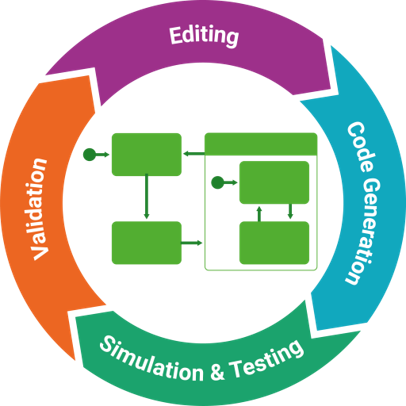
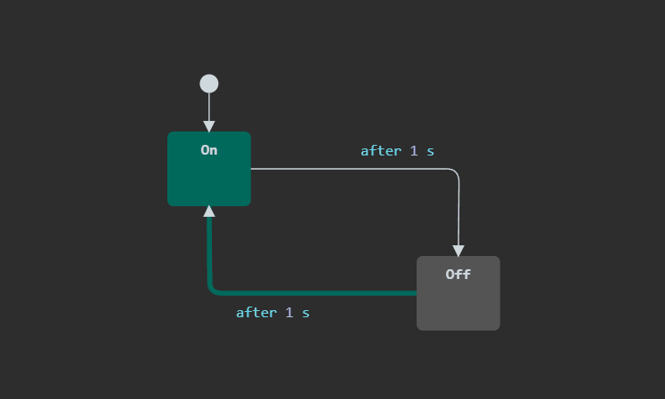
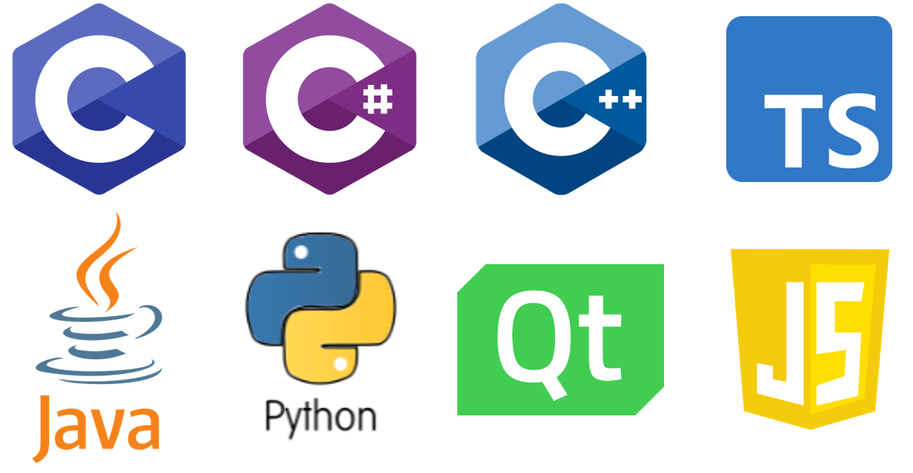

> Note: The extension is not published, yet!

# itemis CREATE for Visual Studio Code

With itemis CREATE, you can easily create complex systems in a visual way. Simulate and test your system’s behavior already while you are modeling. Code generators translate your state machine into high-quality source code for different target platforms.

### Simulation

Time and cost pressures often result in loss of quality. Especially in embedded systems, program errors are getting more expensive the later they are detected; and even worse, they can harm lives.

With itemis CREATE, you can simulate and test your system’s behavior – before writing a single line of code! This dramatically speeds up your code-compile-test cycles. The integrated test and coverage framework verifies the correctness of your system already while you are modeling.

### Code-Generation

Handwritten code needs to be continuously quality assured by time-consuming code reviews to comply with the desired industry coding standards for safety-critical systems. Any change in domain logic may lead to new errors. Especially under time pressure, this becomes a problem for software developers.

With itemis CREATE, this is no longer needed. Your state machine is automatically translated into high-quality source code for different target platforms – no matter if it’s C, C++, Java, or Python. And because state machines are platform-independent, your system is future-proof even if your underlying technology changes.

**Enjoy!**
