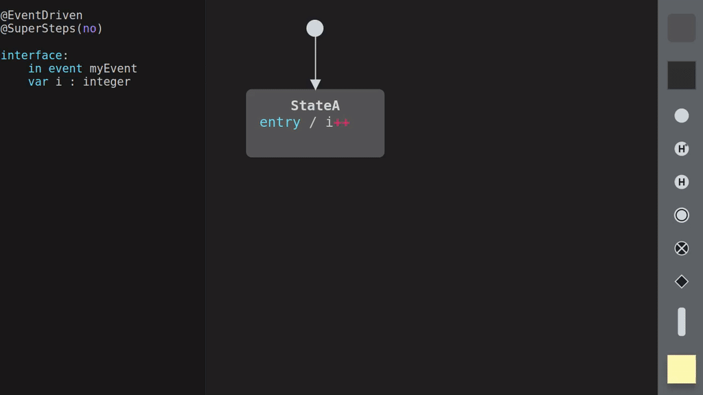
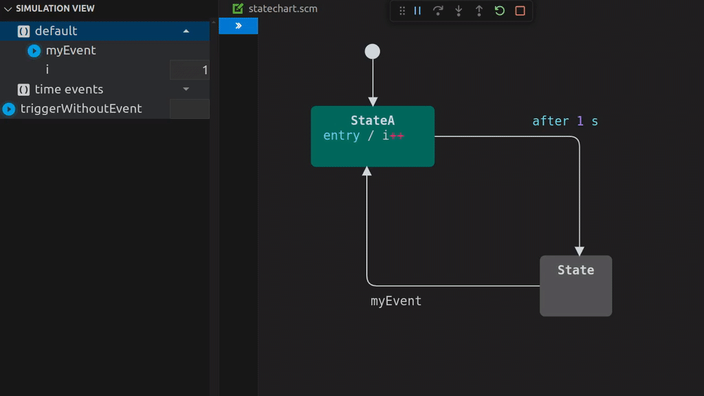

#  itemis CREATE for Visual Studio Code

With itemis CREATE , you can easily create complex systems in a visual way. Simulate and test your system’s behavior already while you are modeling. Code generators translate your state machine into high-quality source code for different target platforms.

Previously available exclusively as an Eclipse-based tool, itemis CREATE now comes as a modern and streamlined Visual Studio Code extension, bringing the power of state machine modeling and simulation to a broader developer audience.

## ⚠️ Extension in Development

This extension is currently a work in progress. Some features may be missing. We appreciate your patience and feedback as we continue to improve it! If you encounter any issues or have feature requests, feel free to open a ticket on our [issue tracker](https://github.com/itemisCREATE/create-vscode-editor/issues).

The following features are not yet implemented:

- **Multi-State Machines:** Importing other state machines is not yet supported.
- **Domains:** The C/C++ domain and others are not yet available, so import statements will not work.
- **Subdiagrams:** Creating subdiagrams is not supported.
- **Import & Export:** Exporting or importing existing statecharts is not possible. However, models from the web version with an `.scm` file extension can be used.
- **SCTUnit:** Creating tests with SCTUnit is not supported.

## Editing & Validation

Designing a robust and well-structured system starts with creating a clear and accurate model. The Editing & Validation capabilities of itemis CREATE make this process both intuitive and error-resistant.

With a user-friendly graphical editor, you can visually model your system's states and transitions, ensuring that complex system logic is easy to comprehend and maintain. Drag-and-drop functionality, alongside context-sensitive tools, allows you to quickly build, modify, and refine your models with minimal effort.



**Key Features:**

- **Graphical Statechart Editing:** Create, modify, and connect states and transitions effortlessly.
- **Seamless Editor Integration:** Integrate state machine editing directly into your VS Code workflow. The `.scm` files are recognized as statechart models, and you can edit them as part of your regular development cycle, with itemis CREATE providing the full modeling, simulation, and code-generation functionality.
- **Real-Time Validation:** Avoid mistakes as you work. itemis CREATE provides instant feedback by validating your model in real time. Errors and warnings are highlighted, guiding you to resolve issues early in the development process.
- **Syntax and Semantics Checks:** Ensure your models adhere to the rules of statecharts and reflect your intended system logic. This reduces costly debugging later on.
- **Consistent Documentation:** Automatically maintain clear and consistent documentation of your system's design as part of your modeling workflow.

By enabling rapid iterations and immediate feedback, the Editing & Validation tools empower you to design robust systems with confidence and precision, laying the foundation for successful simulations, testing, and code generation.

## Simulation

Time and cost pressures often result in loss of quality. Especially in embedded systems, program errors are getting more expensive the later they are detected; and even worse, they can harm lives.

With itemis CREATE, you can simulate and test your system’s behavior – before writing a single line of code! This dramatically speeds up your code-compile-test cycles.



**Key Features:**

- **State Machine Simulation:** Simulate your state machine directly within itemis CREATE to visualize and validate its behavior in real time.
- **Debug Integration:** Integrate simulation directly into your VS Code workflow using `launch.json`. You can start the simulation as part of your normal debugging and development cycle, providing a streamlined approach for testing and iterating your state machine models.
- **Event Triggering:** Raise events manually during the simulation to test how your system reacts to different inputs and scenarios.
- **Variable Management:** Set and read the values of variables on the fly, ensuring your system's logic is functioning as expected under various conditions.
- **Debugging Support:** Monitor the current state, active transitions, and variable changes during the simulation, enabling efficient debugging and fine-tuning of your model.
- **Interactive Exploration:** Explore alternative scenarios and edge cases dynamically without needing to compile or deploy code.

These features ensure that your state machine behaves as intended, helping you catch and resolve issues early in the design process.

## Code Generation

Handwritten code needs to be continuously quality assured by time-consuming code reviews to comply with the desired industry coding standards for safety-critical systems. Any change in domain logic may lead to new errors. Especially under time pressure, this becomes a problem for software developers.

With itemis CREATE, this is no longer needed. Your state machine is automatically translated into high-quality source code for different target platforms – no matter if it’s C, C++, Java, or Python. And because state machines are platform-independent, your system is future-proof even if your underlying technology changes.


**Key Features:**

- **Multi-Language Code Generation:** Automatically generate high-quality code for C, C++, Java, and Python from the same model, ensuring flexibility across different platforms and projects.
- **Workflow Integration:** Easily integrate the code generation process into your VS Code workflow. With `tasks.json`, you can incorporate code generation into your build process, making it a natural part of your regular development cycle.
- **Consistent Model-to-Code Workflow:** Any changes made to the model are instantly reflected in the generated code, eliminating the need for manual implementation and reducing errors.
- **Tested Code:** The generated code is designed to follow best practices and high-quality standards, ensuring reliability and consistency for a wide range of applications.
- **Time-Saving Automation:** Skip time-consuming manual coding processes. With just a few clicks, create platform-independent, production-ready code that aligns perfectly with your model logic.

This approach allows you to focus on designing robust systems while relying on itemis CREATE to handle the implementation details, accelerating your development process and ensuring high-quality results.

## Getting Started

This section provides a practical guide to help you get started with creating, simulating, and generating code from statecharts using itemis CREATE. You’ll learn how to set up your first statechart, simulate its behavior, generate production-ready code, and explore pre-built examples:

- **Statechart Modeling**: Create and edit statecharts with an intuitive graphical editor.
- **Simulation**: Validate your statechart behavior in real-time.
- **Code Generation**: Generate high-quality code in multiple languages from your models.
- **Examples**: Explore prebuilt examples to understand best practices and use cases.

Follow the steps below to get started with creating statecharts, running simulations, generating code, and exploring examples.

### Create a Statechart

To create a statechart, follow these steps:

1. **Add a New File**: Create a new file in your workspace with the `.scm` extension. An initial statechart will be automatically generated for you.
2. **Edit the Statechart**:
   - Open the statechart file to access the graphical editor.
   - Use the **Properties View** in the itemis CREATE panel to customize elements like states, transitions, priorities, and more.

### Start a Simulation

You can simulate your statechart in two ways:

1. **Using the Graphical Editor**:

   - Open your statechart file.
   - Click the **Run Simulation** button (green arrow icon) in the editor toolbar to start the simulation.

2. **Using a `launch.json` Configuration**:
   - Add the following configuration to your `launch.json` file to your `.vscode` folder:
     ```jsonc
     {
       "version": "0.2.0",
       "configurations": [
         {
           "type": "simulation",
           "request": "launch",
           "name": "Simulate Statechart",
           "statechart": "<path to your statechart>"
         }
       ]
     }
     ```
   - Open the **Run and Debug** view in VS Code and select the simulation task to run.

When the simulation starts, VS Code automatically switches to the **Run and Debug View**. Alongside the standard panels — Variables, Watch, Call Stack, and Breakpoints — a dedicated **Simulation View** is available. This view provides powerful tools to:

- Raise events dynamically.
- Inspect and modify variable values in real-time, enabling in-depth testing and debugging.

Additionally, a control bar for your session appears, offering options such as **Restart** and **Stop** to manage your simulation easily. You can even run multiple simulation sessions in parallel, making it possible to test and compare different scenarios simultaneously.

### Generate Code

Code generation is handled through a `tasks.json` file, which also must be located in your `.vscode` folder. Add the following configuration to your `tasks.json`:

```jsonc
{
  "version": "2.0.0",
  "tasks": [
    {
      "label": "Code Generator",
      "type": "codegenerator",
      "generator": {
        "statechart": "<path to your statechart>",
        "features": {
          "Outlet": {
            "targetProject": ".",
            "targetFolder": "src-gen"
          }
        },
        "type": "create::<language>"
      },
      "group": "build"
    }
  ]
}
```

Supported languages include C, C++, Java, and Python. For a full list of supported features and configurations, refer to the [documentation](https://www.itemis.com/en/products/itemis-create/documentation/user-guide/codegen_generating_state_machine_code?hsLang=en).

Once configured, you can execute the task using the Terminal > Run Task command or by integrating it into your build process or you can open the `tasks.json` file and click on **Run Task: Code Generator**.

## Open an Example

An **Examples View** is included in the **itemis CREATE View**, providing a convenient way to explore and learn from pre-built examples.

To get started:

- Open the **Examples View** in the **itemis CREATE View**.
- Browse the tree view, which organizes examples by categories.
- Select an example to open its description in an integrated webview.

A webview displays a detailed description of the example, outlining its purpose and functionality. If you want to work with the example, simply click the **Open** button in the tree view. This will add the example to your workspace, allowing you to explore and modify it as needed.

These examples serve as practical demonstrations of itemis CREATE's features and are valuable for both beginners and advanced users. They not only help new users get started but also provide hands-on examples for advanced use cases, such as integrating the generated code into embedded systems and other complex scenarios.

## Documentation

For more detailed information on itemis CREATE and how to leverage its full potential, please explore the documentation:

- [User Guide](https://www.itemis.com/en/products/itemis-create/documentation/user-guide) - The complete documentation that covers the basics and advanced concepts of state machines, including what statecharts are, the different elements (states, transitions, choices, etc.), execution semantics, and much more:

- [Tutorials](https://www.itemis.com/en/products/itemis-create/documentation/tutorials) - Step-by-step tutorials to help you get started with itemis CREATE, from basic modeling to advanced simulations.

- [Examples](https://www.itemis.com/en/products/itemis-create/documentation/examples/) - A collection of examples to demonstrate how to use itemis CREATE in various scenarios. These examples are also accessible through the VS Code extension.

These resources provide comprehensive guidance to enhance your experience and expertise with itemis CREATE.

## Relase Notes

For detailed information on the latest updates and changes to itemis CREATE, please refer to the official release notes: [itemis CREATE Release Notes](https://www.itemis.com/en/products/itemis-create/documentation/user-guide/release_notes?hsLang=en).

For VS Code-specific release notes, including updates and bug fixes related to the extension, please check the [Changelog](CHANGELOG.md).

## Licenses and Pricing

This extension requires an active [itemis CREATE license](https://www.itemis.com/en/products/itemis-create/licenses/). It uses a cloud-based service, which requires an account and a valid subscription. A test license is automatically active for 30 days.

## Settings

The following settings allow you to customize the behavior of the itemis CREATE extension in Visual Studio Code. You can adjust the drawing canvas, examples repository, and more according to your preferences.

### Show Grid

- **ID**: `itemis-create.showGrid`
- **Type**: Boolean
- **Default**: `false`
- **Description**: This setting determines whether the grid will be displayed on the drawing canvas. Enabling it helps in aligning objects more easily by providing a visual reference.

### Grid Size

- **ID**: `itemis-create.gridSize`
- **Type**: Number
- **Default**: `10`
- **Description**: The grid size defines the spacing between grid lines on the drawing canvas. A smaller value will provide a finer grid, while a larger value will result in a coarser grid.

### Enable Snaplines

- **ID**: `itemis-create.enableSnaplines`
- **Type**: Boolean
- **Default**: `true`
- **Description**: When enabled, snaplines will appear on the drawing canvas, helping you align objects with precision. This can be useful for organizing components or ensuring consistent spacing.

### Documentation

- **ID**: `itemis-create.showDocumentation`
- **Type**: Boolean
- **Default**: `false`
- **Description**: When enabled, the documentation of states and transitions will be shown.

### Show Priorities

- **ID**: `itemis-create.showPriorities`
- **Type**: Boolean
- **Default**: `true`
- **Description**: This setting controls whether priority labels are shown on transitions and regions. Enabling it makes it easier to see and manage priorities in state machines.

### Storage Location

- **ID**: `itemis-create.examples.storageLocation`
- **Type**: String
- **Default**: `create_vscode_examples`
- **Description**: Specifies the local path where the cloned examples repository will be stored. Relative paths are appended to the user's home directory, while absolute paths are used as specified.

### Remote Location

- **ID**: `itemis-create.examples.remoteLocation`
- **Type**: String
- **Default**: `https://github.com/itemisCREATE/examples`
- **Description**: This setting defines the remote URL where the examples repository is hosted. The default location points to the GitHub repository for itemis CREATE examples.

### Remote Branch

- **ID**: `itemis-create.examples.remoteBranch`
- **Type**: String
- **Default**: `vscode-release5`
- **Description**: The remote branch setting specifies which branch of the remote repository to use. The default branch is `vscode-release5`, but it can be changed to any valid branch.
